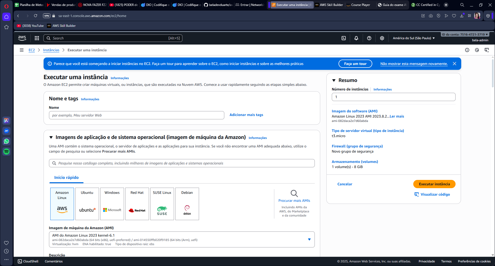
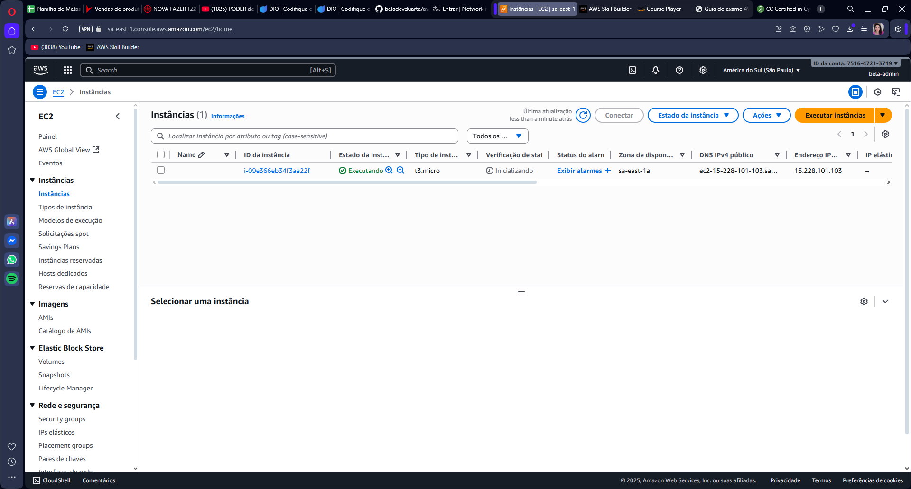

# aws-ec2-ami-snapshots-lab
Laboratório AWS - Gerenciamento de Instâncias EC2, AMIs e Snapshots

# 🚀 Desafio de Projeto - Gerenciamento de Instâncias EC2 na AWS  

Este repositório contém a documentação do **laboratório prático de EC2 na AWS**, com foco em **AMIs (Amazon Machine Images)** e **Snapshots EBS**.  
O objetivo foi **consolidar os conhecimentos adquiridos** em sala, praticando em um ambiente real e registrando a experiência de ponta a ponta.  

---

## 📚 Sumário
- [Objetivos do Desafio](#-objetivos-do-desafio)
- [Arquitetura do Laboratório](#-arquitetura-do-laboratório)
- [Etapas Executadas](#-etapas-executadas)
- [Capturas de Tela](#-capturas-de-tela)
- [Recursos Utilizados](#-recursos-utilizados)
- [Reflexão Pessoal](#-reflexão-pessoal)
- [Conclusão](#-conclusão)

---

## 🎯 Objetivos do Desafio
- Criar e gerenciar instâncias EC2 na AWS.  
- Personalizar instâncias com pacotes adicionais (Apache).  
- Criar **AMIs personalizadas**.  
- Gerar e gerenciar **Snapshots EBS**.  
- Documentar todo o processo de forma clara e organizada.  

---

## 🏗 Arquitetura do Laboratório
Fluxo seguido no laboratório:  

1. Criação de uma instância EC2.  
2. Personalização da instância com Apache.  
3. Criação de AMI personalizada.  
4. Criação de Snapshot do volume EBS.  
5. Lançamento de nova instância a partir da AMI.  
6. Validação do Snapshot como backup.  
 

---

## 🔧 Etapas Executadas

### 1️⃣ Criação da Instância EC2
- Sistema operacional: **Amazon Linux 2**  
- Tipo de instância: **t2.micro (Free Tier)**  
- Configurações principais:
  - Porta 22 (SSH) liberada  
  - Porta 80 (HTTP) liberada  
- Volume EBS padrão de 8 GB  

📸 *Print da instância criada*  


---

### 2️⃣ Instância em Execução
Após o deploy, a instância foi iniciada com sucesso e entrou no estado **Running**.  

📸 **Print da instância rodando:**  



---

### 3️⃣ Conexão via SSH e Instalação do Apache
Comando para acessar:  
````bash
ssh -i minha-chave.pem ec2-user@<IP-da-instancia>
````

 Instalação e Configuração do Servidor Web Apache:
Esta etapa simula a instalação de uma aplicação essencial, que será a base da nossa AMI.

1 Atualização do sistema operacional:

````Bash

sudo yum update -y
Instalação do Apache HTTP Server (httpd):

````
````Bash

sudo yum install httpd -y
Iniciando e habilitando o serviço para iniciar automaticamente (autostart):
````
````Bash

sudo systemctl start httpd
sudo systemctl enable httpd
Personalização (Conteúdo de Teste): Para validação futura, um arquivo de index básico foi criado.
````
````Bash

echo "<h1>Desafio DIO AWS: EC2 e AMI - Sucesso!</h1>" | sudo tee /var/www/html/in
````


💡 Reflexão Pessoal
O principal aprendizado deste laboratório reside na distinção estratégica entre AMIs e Snapshots, 
e como eles se complementam na gestão de infraestrutura na AWS.

Recurso	Função Estratégica	Foco
AMI	Provisionamento: Utilizado para lançar instâncias idênticas de forma rápida, 
garantindo a consistência do ambiente base.	Agilidade e Consistência (Escala)
Snapshot	Backup: Cópia de segurança pontual e incremental do volume EBS,
essencial para a Recuperação de Desastres (DR).	Segurança e Restauração (Resiliência)
Sinergia: O Snapshot é o componente de armazenamento que sustenta o template da AMI. 
Um bom gerenciamento de Snapshots é crucial, pois afeta a performance das AMIs e os custos de armazenamento.

Conclusão: A capacidade de criar uma AMI para otimizar deploys e de gerar Snapshots para 
garantir a resiliência do ambiente são práticas fundamentais para qualquer engenheiro de Cloud.


✅ Conclusão
O laboratório foi concluído com sucesso, atingindo todos os objetivos propostos:

A instância EC2 foi criada e personalizada (Apache).

Uma AMI personalizada foi gerada.

Um Snapshot EBS de backup foi criado e validado como mecanismo de recuperação.

Todo o processo foi documentado de forma clara e estruturada neste repositório.

A prática consolida os conhecimentos em provisionamento, persistência de dados e estratégias de backup na plataforma AWS.
